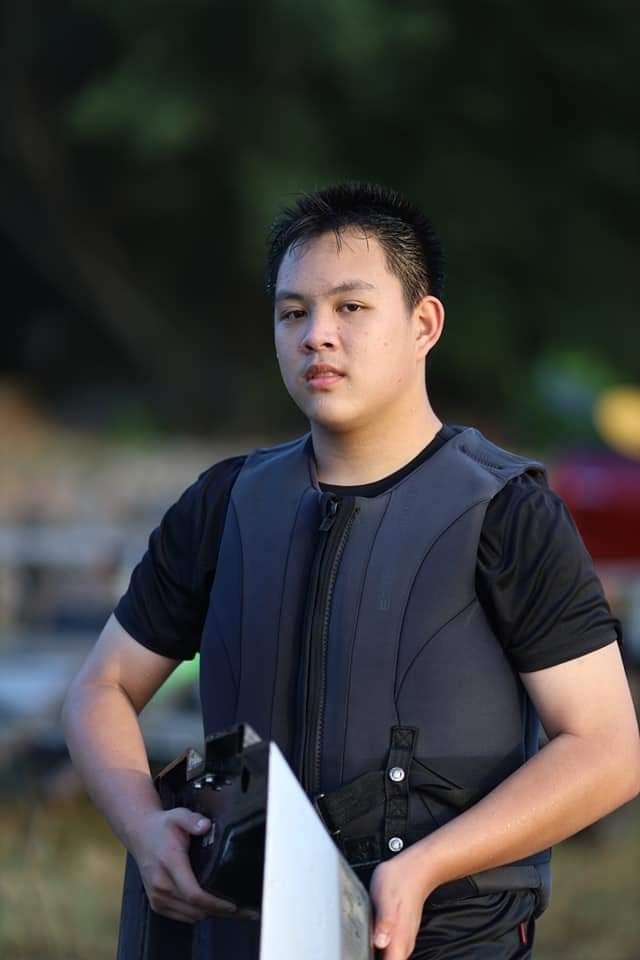

# 👨‍💻 Vanich viriyakerkgraikul Profile | 
## NickName : simon  |  Student ID : 69130500057 |

## Personal Profile
* **Name :** Vanich viriyakerkgraikul
* **NickName :** simon
* **Date of Birth :** 04 december 2007

## Education
* **King Mongkut's University of Technology Thonburi  (KMUTT) "** — Bachelor's Degree (Currently Studying)
* **sakaeoschool** — Secondary school 
* **assumption college sriracha** — Primary school 

## Hobby 
**What do you like to do in your free time and why?** 
- I like to listen to live streams on Channel 9arm because during the live streams, I learn new information and news about tech, such as 4 days ago, OpenAI's AI escaped from the test area and hacked a real company, and it was also a zero-day vulnerability hack.   

## Goals & Passion  
**What are your goals and passions?**
- I want to work in cyber security and I want to have my own business where I can work on my own. My inspiration to work in cyber security started when I was a kid, when I thought it looked cool and was very important. When I grew up, I saw news about various criminals, which further emphasized that there is a real problem that is clearly visible, and how important and interesting our job is. As for the business, my inspiration is that if my business can operate without me having to supervise it all the time, I can take a break and take my family on a trip.

## Quotation
**What is your motto and what does it mean?**
- "There is no change where there is no action."

## Strength
**What do you think are your strengths and how can you develop and build upon them?**
- Dare to learn new things. Think using reason rather than emotion. Dare to learn new skills from friends you've just met. And have empathy for others. In real work, we can use this part to help us continue to work on our own development. Learn from others on the team, work with the team, and lead the team to success together.

## Weakness
**What do you think are your weaknesses, what problems do you face nowadays, and how can you handle them?**
- I'm  who likes to compare myself to others quite a lot, to the point that sometimes it puts too much pressure on me. I like to keep thinking and doing things over and over again, wondering if it's okay, what other people will think. This can be fixed by taking time to accept myself more and more. As we grow up, we encounter different things, and I believe that what we are experiencing now will diminish and eventually disappear.

## What music genre do you like to listen to, and why do you like listening to this genre?  
- Alternative Rock, Modern Rock, and J-Rock—all of these make me feel excited and remind me that the bad parts of the day don't define the whole day; there are still fun things waiting for me.

## When choosing to buy a product or service, what do you pay the most attention to?
- i buy a product and i look at the quality the most because it's something we'll see and touch throughout its use.

## Social Media 
**Facebook :**[Simon Eiei](https://www.facebook.com/share/1Jh2WFszkY/)
**Instagram :**[kchinoz_x](https://www.instagram.com/kchinoz_x?igsh=MThob3k2amF0cXFrNg==)
**GitHub :**[simon36060](https://github.com/simon36060) 

## The interviewer and first impression
**The Interview**
* **Teerapat Pinkeaw **   

 **Interview ID**
* **69130500027**

 **interview's impression**  
* **I feel that my friends are easy to talk to, but there may still be some unfamiliarity because we've just met. I may feel nervous during the interview.**

---
---
 
 
 
 

